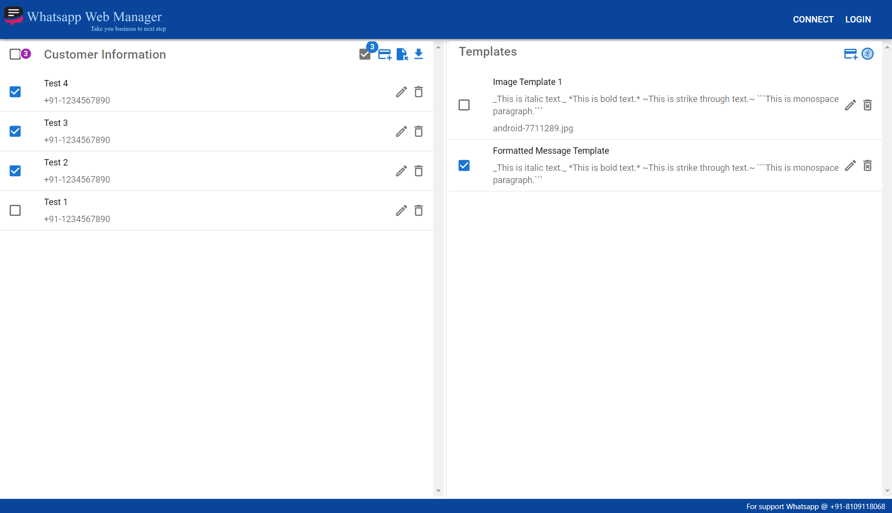

# Whatsapp Web Manager

This is a test project that automate the process of sending whatsapp messages to contact numbers.

## Features :-
-   Create, Edit, Upload & Export contact details in excel format.
-   Creating message templates using images and text formatting
-   Sending a message template to multiple contacts.
-   Connection to whatsapp web using whatsapp qrcode scanner.
-   Cross platform application (tested in Windows x64)

>   :notice: This just a preview project if you thinking about using it **please read Whatsapp policy about sending mass messages.**

